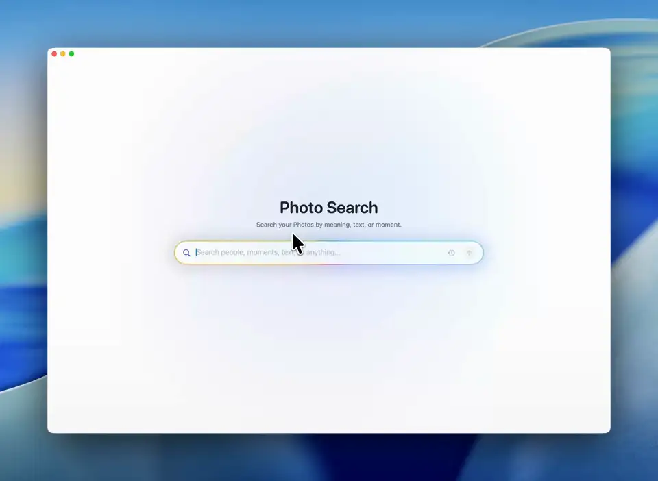

# Photo Search

**English** · [简体中文](README.zh-CN.md)

Local-first semantic search for an Apple Photos library.

## Demo

Search by what you remember: people, scenes, visible text, or a natural-language
description of the moment.



This is the single repository for both parts of the product:

- `Sources/`, `Tests/`, `Package.swift`, and `scripts/`: native SwiftUI macOS app.
- `backend/`: PhotoKit export, Apple Vision OCR, model annotations, SQLite index,
  local web fallback, and background services.
- `~/Library/Application Support/PhotoSearch/`: private runtime data, previews,
  model-provider configuration, worker state, and logs.

The application reads Apple Photos through public APIs and never modifies the
Photos library. Derived artifacts are versioned by model, prompt, schema,
preprocessing version, and input hash.

## Build the app

```bash
swift test
scripts/build_app.sh --version 0.1.0 --build <build-number>
open "dist/Photo Search.app"
```

## Run the backend

```bash
cd backend
.venv/bin/python -m unittest discover -s tests
.venv/bin/photo-search doctor
scripts/install_background_services.sh
```

Background services:

- `com.popcornnn.photo-search.web`
- `com.popcornnn.photo-search.worker`
- `com.popcornnn.photo-search.network`

The App's **Settings → Models** page manages local and cloud
OpenAI-compatible providers. Endpoint and model configuration is stored in the
private runtime directory; API keys are stored in macOS Keychain.

See [backend/README.md](backend/README.md) for CLI and indexing details.
